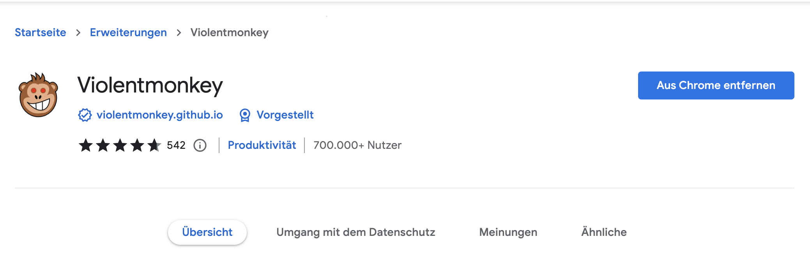
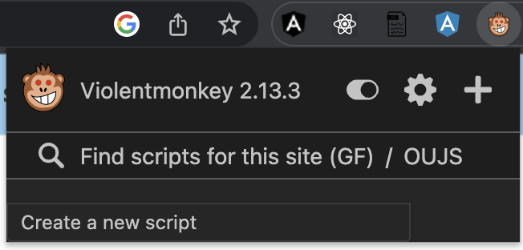
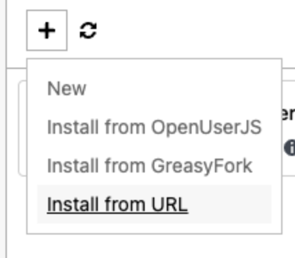
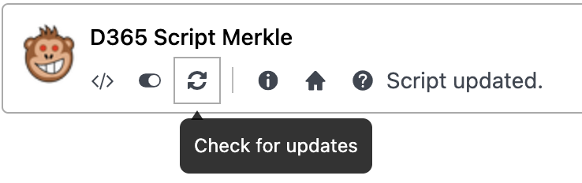

# D365 Tool
## How to start the script
1. Go to the [chrome web store](https://chrome.google.com/webstore/detail/violentmonkey/jinjaccalgkegednnccohejagnlnfdag?hl=de) and install violent monkey 
2. After installing violentmonkey. The violentmonkey icon should appear in the top right corner of the screen. Where the extension tab is.
3. Then you click on the violentmonkey icon. And go the setting.
4. On the violentmonkey page. Click on the plus icon and then add from url. Then you go to the github repository and choose the file and open it raw and copy that url and past it on the violentmonkey page.  
And Paste this url: https://raw.githubusercontent.com/alejandrolue/D365/main/D365Tool.js
## Updating the Script.
If there is a new Version of the script. You are able to update it in the settings by simply clicking the refresh icon. Then the script should be running the newest version.

