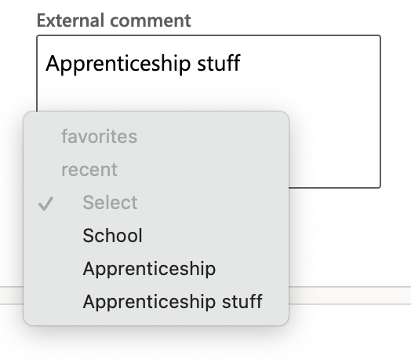
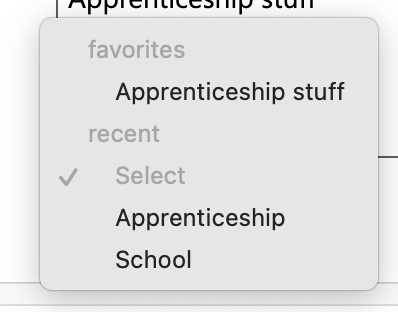
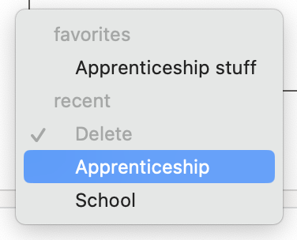
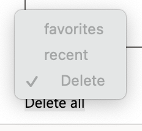

# How the script works
1. If you type something in the textbox and click outside of. The Value gets saved and that value is shown in the dropdown.

2. When you select a value in the dropdown it will be pasted in the texbtox. If you use it more than 5 times a certain value. It will be shown in the favorites section and the values in the Select or Delete dropdown are sorted by how many times they have been used. And if there are more than 10 values in the dropdown the least used one gets deleted and replaced by the new value.

3. In the delete dropdown if clicked on a value it gets deleted.

4. If clicked on the delete all button. All the values in the dropdown get deleted.

